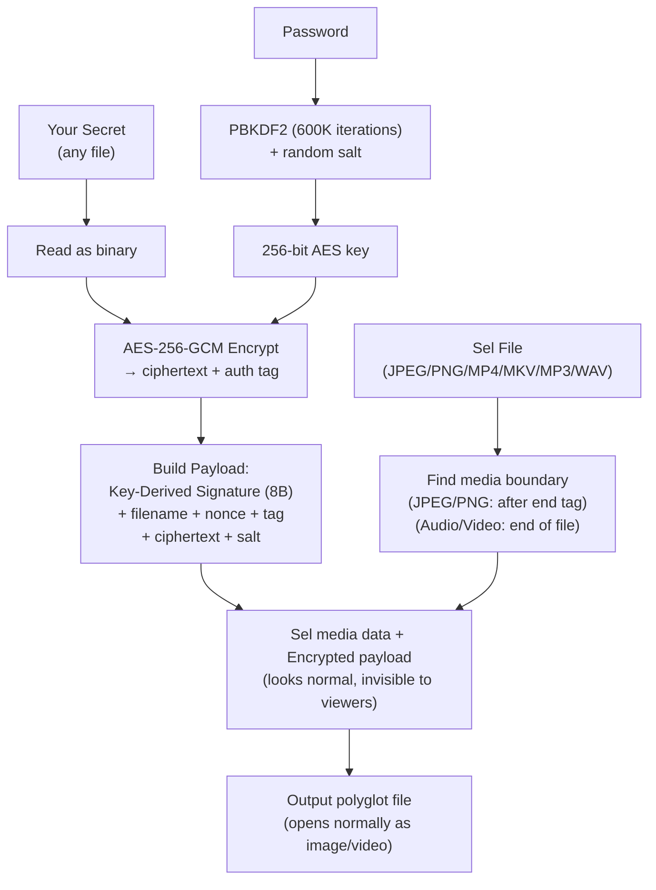
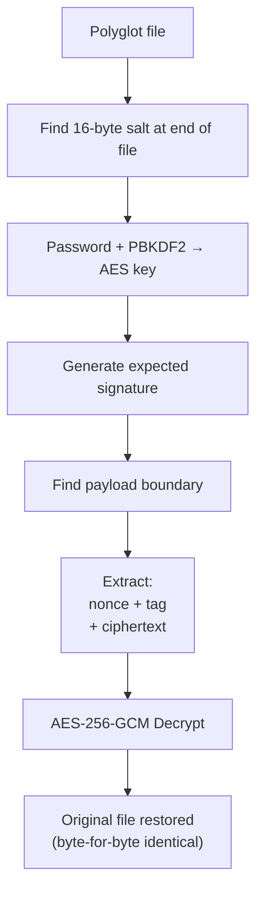
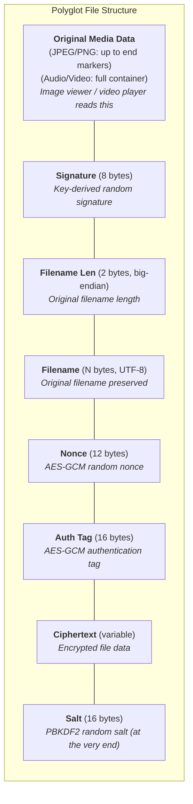

# 🦠 Parasyte

**Encrypt any file and hide it inside innocent-looking media files.**

Parasyte uses **AES-256-GCM encryption** combined with the **polyglot file technique** to embed encrypted data inside images (JPEG, PNG) and audio/video media (MP4, MKV, MP3, WAV). The output files look and behave completely normal — they open in image viewers and media players — but contain your secret data, recoverable only with the correct password.

---

## 🚀 One-Line Install (macOS & Linux)

The easiest and fastest way to install Parasyte globally on your system is via our automated installer:

```bash
curl -fsSL https://raw.githubusercontent.com/Shiyinq/parasyte/main/install.sh | bash
```

*(This script automatically fetches the latest pre-compiled C-binary from GitHub Releases and sets it up instantly.)*

---

## Table of Contents

- [Terminology](#terminology)
- [How It Works](#how-it-works)
- [Installation](#installation)
- [Quick Start](#quick-start)
- [Usage](#usage)
  - [Infect (Encrypt)](#infect-encrypt)
  - [Cure (Decrypt)](#cure-decrypt)
- [Examples](#examples)
- [Project Structure](#project-structure)
- [Security Details](#security-details)
- [Limitations](#limitations)
- [Running Tests](#running-tests)

---

## Terminology

To embrace the biological Sci-Fi theme, this CLI uses specialized terms instead of boring standard cryptographic words. Here is your survival guide:

| Term | Technical Meaning | Description |
|---|---|---|
| **`infect`** | **Encrypt** | The command to encrypt your secret data and inject it into a media file. |
| **`cure`** | **Decrypt** | The command to extract and decrypt your data back from an infected file. |
| **`--dna`** | **Payload / Data** | Your secret files (the "genetic code" of the parasite) that you want to hide. |
| **`--sel`** | **Sel** | The innocent-looking media file (image, video, audio) that will act as the disguise. |
| **`--inang`** | **Input Host** | The infected file or folder (Host) you want to cure. |
| **`--hive`** | **Output Directory** | The folder where the resulting infected (or cured) files will be saved. |
| **`--chromosome`** | **Zip Compression** | Condenses your DNA folder into a single tight package (ZIP) before infecting. |
| **`--helicase`** | **Zip Extraction** | Unwinds and automatically extracts the chromosome payload (ZIP) during the cure process. |
| **`--shred`** | **Secure Delete** | Permanently and securely wipes the original DNA file from your hard drive after a successful infection. |

---

## How It Works

### The Polyglot Technique

A **polyglot file** is a single file that is valid in two or more formats simultaneously. Parasyte exploits how media formats handle their data boundaries:

- **JPEG / PNG** files have specific end markers (`FF D9` for JPEG, `IEND` for PNG). Image viewers stop reading after this marker and ignore anything that follows.
- **Audio / Video** files (MP4, MKV, MP3, WAV) use container structures or frame formats. Players only read the declared structure/duration and ignore trailing data.

Parasyte appends encrypted data **after** these boundaries. The result is a file that:
- ✅ Opens normally in image viewers / video players
- ✅ Passes basic file format validation
- ✅ Contains your encrypted secret data

### Encryption Flow



### Decryption Flow



### File Structure



---

## Installation

### Prerequisites

- Python 3.10+
- pip

### Setup

```bash
# Clone or navigate to the project
cd parasyte

# Create virtual environment
python -m venv .venv

# Activate virtual environment
source .venv/bin/activate   # macOS/Linux
# .venv\Scripts\activate    # Windows

# Install dependencies
pip install pycryptodome
```

**That's it.** Only one external dependency (`pycryptodome`).

### Build from Source (Nuitka Compilation)

If you want to compile Parasyte into a native C-binary yourself (so you can run it anywhere natively without Python), you can use the provided Makefile which uses Nuitka:

```bash
make install
make build
```

This will compile the Python code and generate a `dist/parasyte.dist` folder. You can then install it globally to your system:
```bash
make install-parasyte
```

---

## Quick Start

```bash
# 1. Put sel files (JPEG/PNG/MP4/MKV/MP3/WAV) in the sel/ folder
#    These are the "disguise" files — your secret will be hidden inside them.

# 2. Infect a sel
python parasyte.py infect --dna dna/example.png
# → Enter password (hidden input)
# → Output: hive/example.png  (assuming the sel assigned was example.png)

# 3. The output file looks like a normal image/video!
open hive/example.png   # Opens in Preview

# 4. Cure it back
python parasyte.py cure --inang hive/example.png
# → Enter password
# → Output: hive/cured/example.png  (identical to the original)
```

---

## Usage

### Infect (Encrypt)

```bash
python parasyte.py infect --dna <file_or_folder> [--sel <sel_path>] [--hive <output_path>] [--shred]
```

| Flag | Required | Default | Description |
|------|----------|---------|-------------|
| `--dna` | ✅ | — | DNA Payload (file or folder to hide). If folder, all files inside are infected recursively. |
| `--sel` | ❌ | `sel/` | Path to sel files. A random sel is assigned to each DNA file. |
| `--hive` | ❌ | `hive/` | Output folder for infected polyglot files. |
| `--shred` | ❌ | `False` | Securely destroy the original DNA file with random bytes after successful infection. |

**Sel assignment rules:**
- Each DNA file is randomly assigned a sel (never sequential).
- If there are more sel_files than DNA files, each DNA file gets a unique sel.
- If there are fewer sel_files than DNA files, some sel_files are reused.

### Cure (Decrypt)

```bash
python parasyte.py cure --inang <file_or_folder> [--hive <output_path>]
```

| Flag | Required | Default | Description |
|------|----------|---------|-------------|
| `--inang` | ✅ | — | Infected polyglot file or folder to cure. If folder, all media files inside are cured recursively. |
| `--hive` | ❌ | `<inang>/cured/` | Output folder for cured files. Files are restored with their original DNA filenames. |

---

## Examples

### Encrypt a single file

```bash
python parasyte.py infect --dna dna/example.png
```

Output:
```text
  Infection Plan

  DNA Payload   1 file(s) from 'dna/example.png'
  Sels      3 file(s) from 'sel/'
  Hive Output   hive
  Encryption    AES-256-GCM (PBKDF2 600,000 iterations)

Enter password:
Confirm password:

Infecting...
[ SUCCESS ] example.png -> example.png (2,048,000 -> 2,325,085 bytes)
Processing... ━━━━━━━━━━━━━━━━━━━━━━━━━━━━━━━━━━━━━━━━ 100% 0:00:00

Done: 1/1 file(s) infected successfully
Output directory: /path/to/hive
To cure: python parasyte.py cure --inang hive
```

### Infect an entire folder

```bash
python parasyte.py infect \
  --dna ./secret_documents/ \
  --sel /Volumes/USB/sel/ \
  --hive /Volumes/USB/hive/
```

Output:
```text
  Infection Plan

  DNA Payload   5 file(s) from './secret_documents/'
  Sels      3 file(s) from '/Volumes/USB/sel/'
  Hive Output   /Volumes/USB/hive/
  Encryption    AES-256-GCM (PBKDF2 600,000 iterations)

Enter password:
Confirm password:

Infecting...
[ SUCCESS ] contract.pdf -> vacation.mp4 (1,200,000 -> 3,400,000 bytes)
[ SUCCESS ] id_card.jpg -> sunset.jpeg (500,000 -> 1,200,000 bytes)
[ SUCCESS ] tax_return.pdf -> cat_video.mkv (2,000,000 -> 8,500,000 bytes)
[ SUCCESS ] bank_stmt.pdf -> sunset_1.jpeg (300,000 -> 1,000,000 bytes)
[ SUCCESS ] medical.pdf -> vacation_1.mp4 (800,000 -> 3,000,000 bytes)
Processing... ━━━━━━━━━━━━━━━━━━━━━━━━━━━━━━━━━━━━━━━━ 100% 0:00:02

Done: 5/5 file(s) infected successfully
Output directory: /Volumes/USB/hive/
To cure: python parasyte.py cure --inang /Volumes/USB/hive/
```

### Zip & Unzip Automatically (Chromosome & Helicase)

If you have a large folder with many files and you don't want to infect them individually into dozens of sel_files, you can use the `--chromosome` flag (acting like DNA supercoiling). Parasyte will automatically condense your target folder into a single `.zip` file, encrypt it, and embed it into a single sel.

```bash
# Zips the folder, encrypts it, and infects a single sel
python parasyte.py infect \
  --dna ./secret_documents/ \
  --sel /Volumes/USB/sel/ \
  --hive /Volumes/USB/hive/ \
  --chromosome
```

To extract it smoothly, add the `--helicase` flag during the cure process (acting like DNA unwinding). Parasyte will decrypt the payload and, if it detects a valid condensed chromosome (ZIP), it will automatically extract its contents and delete the raw ZIP file.

```bash
# Cures the file and automatically unwinds the chromosome payload
python parasyte.py cure --inang /Volumes/USB/hive/ --helicase
```

### Cure an entire hive

```bash
python parasyte.py cure --inang /Volumes/USB/hive/
```

Output:
```text
  Curing Plan

  Infected Files   5 file(s) from '/Volumes/USB/hive/'
  Output Directory /Volumes/USB/hive/cured

Enter password:

Curing...
[ SUCCESS ] vacation.mp4 -> contract.pdf (sha256:a1b2c3)
[ SUCCESS ] sunset.jpeg -> id_card.jpg (sha256:d4e5f6)
...
Processing... ━━━━━━━━━━━━━━━━━━━━━━━━━━━━━━━━━━━━━━━━ 100% 0:00:02

Done: 5/5 file(s) cured successfully
Cured output at: /Volumes/USB/hive/cured
```

### Cure to a specific folder

```bash
python parasyte.py cure --input hive/ --hive ~/Desktop/cured_data/
```

---

## Project Structure

```
parasyte/
├── .github/             # GitHub Actions workflows
├── .gitignore           # Ignored files configuration
├── core.py              # Cryptography and polyglot core engine
├── install.sh           # Global installation script
├── Makefile             # Build automation
├── parasyte.py          # Main CLI application
├── README.md            # This file
├── requirements.txt     # Python dependencies
├── test_verify.py       # Automated verification tests
├── update_version.py    # Script to bump version
└── version.py           # Version tracking
```

---

## Security Details

| Component | Specification |
|-----------|--------------|
| **Encryption** | AES-256-GCM (authenticated encryption) |
| **Key Derivation** | PBKDF2 with 600,000 iterations |
| **Hash Function** | SHA-256 (for PBKDF2 HMAC & Signature) |
| **Salt** | 16 bytes, cryptographically random (stored at end of file) |
| **Nonce** | 12 bytes, cryptographically random (unique per file) |
| **Auth Tag** | 16 bytes (provided by GCM mode) |
| **Signature** | 8 bytes, derived from AES key using SHA-256 |
| **Library** | PyCryptodome |

### What AES-GCM provides:

- **Confidentiality** — data is unreadable without the key
- **Integrity** — any modification to the ciphertext is detected
- **Authenticity** — guarantees the data was encrypted with the correct key

### What happens with a wrong password:

The decryption **fails completely** with an error. It does **not** produce corrupted or partial output. This is a key advantage of authenticated encryption (GCM mode) over simpler modes like CBC.

---

## Limitations

### Social Media Re-encoding

Most social media platforms **re-encode** uploaded images and videos. This process creates a brand new file from pixel/frame data, which **destroys** the hidden payload.

| Platform | Survives upload? |
|----------|:---------------:|
| Instagram | ❌ |
| Facebook | ❌ |
| Twitter/X | ❌ |
| WhatsApp (as photo) | ❌ |
| Telegram (as file/document) | ✅ |
| WhatsApp (as document) | ✅ |
| Google Drive | ✅ |
| Dropbox | ✅ |
| Email attachment | ✅ |
| USB / direct transfer | ✅ |

**Rule of thumb:** As long as the file is transferred as-is (not re-encoded), the hidden data survives.

### File Size

The output file size = sel size + encrypted data size + small overhead (~50 bytes).

If your secret file is much larger than the sel, the output file will be noticeably larger. For example, a 200 KB JPEG sel containing a 500 MB video will produce a ~500 MB "image" — which may look suspicious.

### Memory Usage

The current implementation loads entire files into memory. For very large files (>1 GB), this may require significant RAM.

---

## Running Tests

```bash
source .venv/bin/activate
python test_verify.py
```

The test suite verifies:
1. **Sel assignment logic** — unique assignment, reuse, and randomness
2. **Encrypt/decrypt roundtrip** — every data file × every sel format
3. **Data integrity** — byte-for-byte comparison via SHA-256
4. **Wrong password rejection** — ensures wrong passwords are detected
5. **File format validity** — output files have correct media headers

---

## License

MIT
